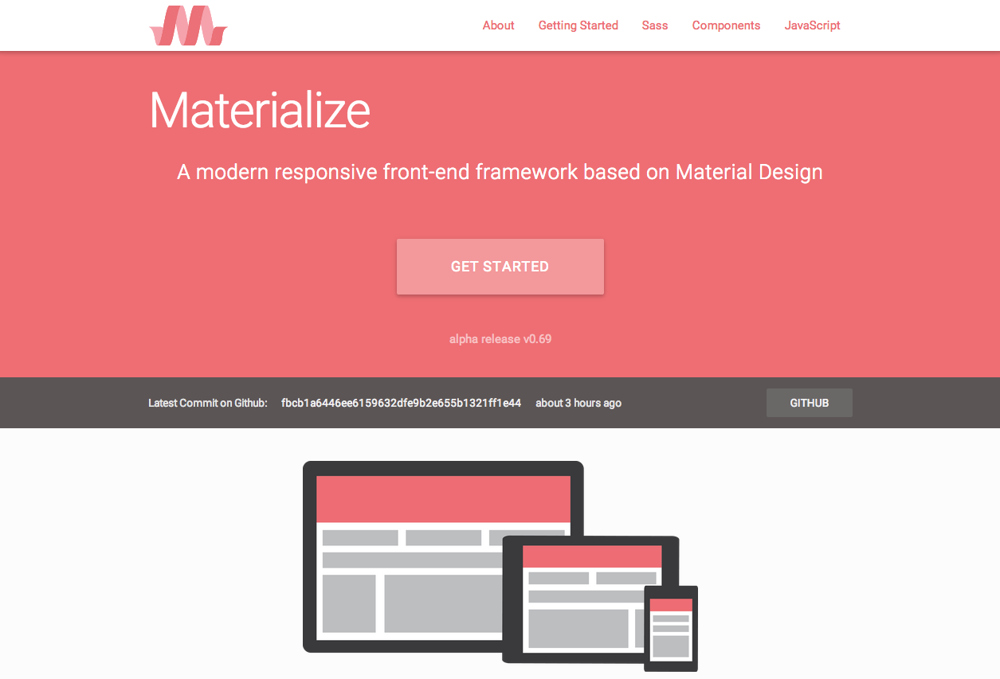

# MaterialPress v 0.1

Welcome to the beginning of MaterialPress! 
------------------------------------------

MaterialPress is a WordPress theme, influenced heavily by Google's Material Design philosophy. Several front end styles have been adapted from the [Materialize](https://github.com/Dogfalo/materialize) front-end framework. 

MaterialPress is in extreme infancy, (*I had the idea just a few days ago*), so I am looking forward to adding more to make this a quality open source WordPress theme for those of us who love and appreciate Google's new aesthetic. 

---

## Roadmap

- [X] Additional JS from Materialize front-end framework
- [ ] General markup clean up and organization (I did this so quickly, please forgive me!)
- [ ] Setup roots.io framework as base
	- [ ] Support for widgets, sidebar and footer widget areas 
	- [ ] Comment support
	- [ ] Post format support
	- [ ] Theme customizer options
- [ ] Setup task runner for development
- [ ] Add Material UI icons
- [ ] JS clean up
	- [ ] Fix Toast
	- [ ] Fixed tab bar
	- [ ] Parallax support

---

More features will be added to the roadmap as time goes on. I'm shooting to have the first public version of the theme ready for testing and submission to the theme repository soon.

Feel free to contact me via [email](mailto:patin.alex@gmail.com) or [my website](http://alexpatin.com) if you have any questions or if you are interested in helping make MaterialPress! You are more than welcome to fork and contibute if you have any ideas.

License: GPL v2